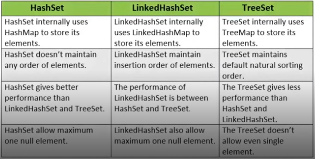

# Collection

### O que é?

É um objeto que agrupa múltiplos elementos (variáveis primitivas ou objetos) dentro de uma única unidade, armazenando e processando conjunto de dados de forma eficiente. O Collection é um framework que implementa esta lógica.

### Composição

- <u>Interface</u>: É um contrato que quando assumido por uma classe deve ser implementado.
- <u>Implementação ou Classes</u>: São as materializações, a codificação das interfaces.
- <u>Algoritmos</u>: É uma sequência lógica, finita e definida de instruções que devem ser seguidas para resolver um problema.


---

### Interface List

*java.util.List*

<u>Características</u>: Permite elementos duplicados e garante ordem de inserção.

<u>Implementações</u>:
- Vector: Threads.
- ArrayList: Implementa a Interface List.
- LinkedList: Implementa a List e a Queue.


---

### Interface Set

*java.util.Set*

<u>Características</u>: Não permite elementos duplicados e não possuí índice.

<u>Implementações</u>:
- TreeSet: Implementa uma coleção ordenada automaticamente.
- HashSet: Implementa uma coleção aleatória, bem performático.
- LinkedHashSet: Implementa uma coleção que mantém a ordem de inserção.



---

### Interface Map

*java.util.Map*

<u>Características</u>: Elementos únicos para cada valor. key - value. É como o objeto do JavaScript, não posso ter propriedades repetidas.

<u>Implementações</u>:
- HashMap: Iteração aleatória, permite chaves nulas.
- LinkedHashMap: Ordenada de acordo com a inseração ou acesso (definida na construção), permite chaves nulas. 
- TreeMap: Implementa uma coleção ordenada, usaremos bastante em ordenações e comperações, não permite chaves nulas em regra geral.

---

### Classe Anônima

É uma classe que não recebeu nome e é tanto declarada quanto instanciada em um único momento. Considerar usar sempre que for instanciar a classe apenas uma única vez.

<u>Exemplo</u>: Os comparators, que instanciamos apenas uma única vez, pode ser chamado (como callbacks do JS) dentro do método sort.

```java
cats.sort(new Comparator<Cat>() {
  @Override
  public int compare(Cat c1, Cat c2) {
    return Integer.compare(g1.getAge(), g2.getAge());
  }
});
```

---

### Functional Interface

Qualquer interface com Single Abstract Method - SAM é uma interface funcional e sua implementação pode ser tratada como expressões lambda.

Abstract Method são métodos que não requerem implementação, ou seja, não há corpo. `abstract void moveTo(double deltaX, double deltaY);`. Também são assim as Classes Abstratas: `public abstract class GraphicObject { abstract void draw() }` - Essa é uma SAM.

<u>Exemplos</u>: Comparator, Consumer, Function, Predicate.

```java
// Com Annotation FunctionalInterface
@FunctionalInterface
public interface Comparator<T> {
  @Contact(pure = true) int compare(T var1, T var2);
}

// Sem Annotation FunctionalInterface
public interface ActionListener extends EventListener {
  void actionPerformed(ActionEvent var1);
}
```

---

### Expressões Lambda

Uma função lambda é uma função sem declaração, isto é, não é necessário colocar um nome, um tipo de retorno e o modificador de acesso. A ideia é que o método seja declarado no mesmo lugar em que será usado. As funções lambda em Java tem a sintaxe definida como `(args) -> (body)`.

É uma simplificação da Classe Anônima.

```java
// Sem Lambda
cats.sort(Comparator.comparing(new Function<Cat, String>() {
  @Override
  public String apply(Cat cat) {
    return cat.getName();
  }
}));

// Com Lambda
cats.sort(Comparator.comparing((Cat cat) -> cat.getName()));
```

---

### Reference Method

É um recurso que permite fazer referência a um método ou construtor de uma classe (de forma funcional) e assim indicar que ele deve ser utilizado num ponto específico do código, deixando-o mais simples e legível. Para utilizá-lo, basta informar uma classe ou referência seguida do símbolo "::" e o nome do método sem os parênteses no final.

É uma simplificação do lambda expression.

```java
// Com Lambda e sem Reference Method
cats.sort(Comparator.comparing((Cat cat) -> cat.getName()));

// Com Reference Method
cats.sort(Comparator.comparing(Cat::getName));
```

---

### Stream API

Traz uma nova opção para a manipulação de coleções em Java seguindo os princípios da programação funcional. Combinada com as expressões lambda, ela proporciona uma forma diferente de lidar com conjuntos de elementos, oferecendo ao desenvolvedor uma maneira simples e concisa de escrever código que resulta em facildiade de manutenção e paralelização sem efeitos indesejados em tempo de execução.

Como usar? Source -> Pipeline -> Terminal.