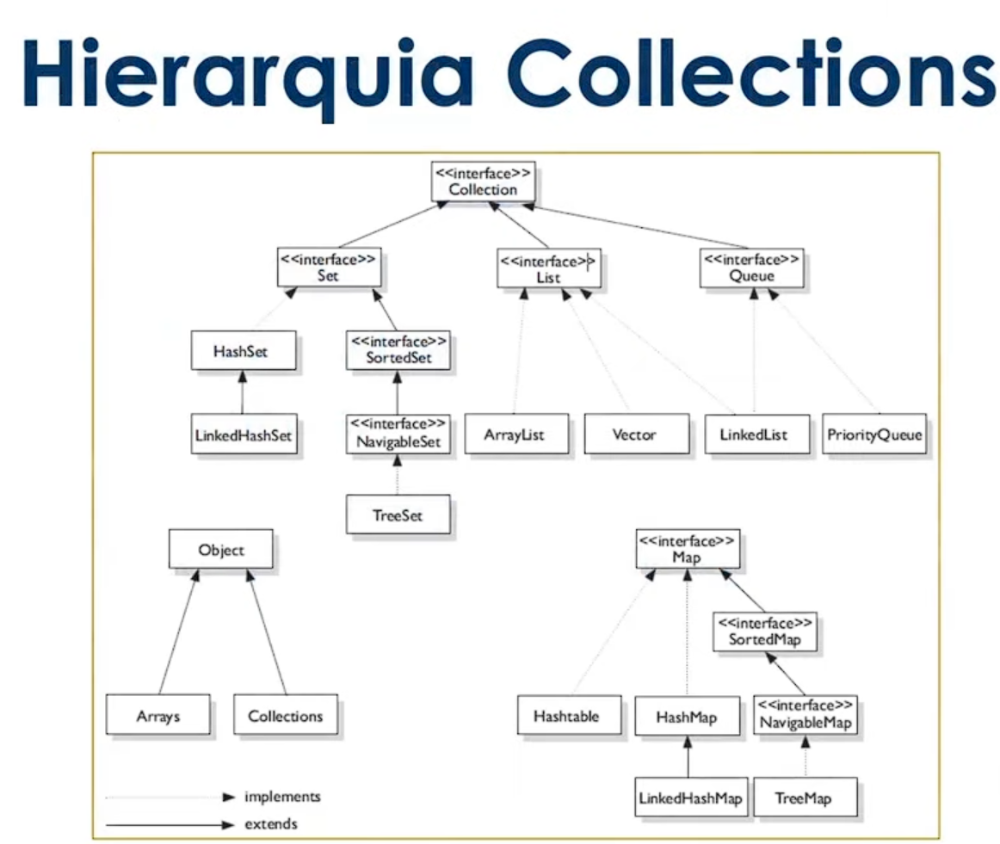
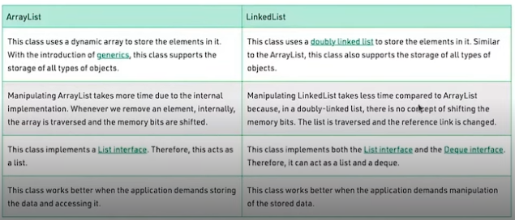

# Collection

### O que é?

É um objeto que agrupa múltiplos elementos (variáveis primitivas ou objetos) dentro de uma única unidade, armazenando e processando conjunto de dados de forma eficiente. O Collection é um framework que implementa esta lógica.

### Composição

- <u>Interface</u>: É um contrato que quando assumido por uma classe deve ser implementado.
- <u>Implementação ou Classes</u>: São as materializações, a codificação das interfaces.
- <u>Algoritmos</u>: É uma sequência lógica, finita e definida de instruções que devem ser seguidas para resolver um problema.

---

### Interface List

*java.util.List*

<u>Características</u>: Permite elementos duplicados e garante ordem de inserção.

<u>Implementações</u>:
- Vector: Threads.
- ArrayList: Implementa a Interface List.
- LinkedList: Implementa a List e a Queue.

