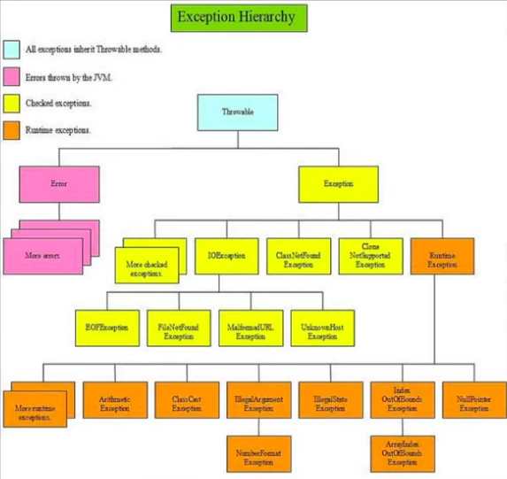

# Tratamento de Execeções

Exceção é um evento que interrompe o fluxo normal do processamento de uma classe, o uso correto de exceções torna o programa mais robusto e confiável.

Com o tratamento de exceções, um programa pode continuar executando depois de lidar com um problema.

<u>**Importante**</u>: Incorpore a estratégia de tratamento de exceções no sistema desde o princípio do processo do projeto, pois pode ser difícil incluir um tratamento de exceções eficiente depois que um sistema foi implementado.

---

### Classificação de Erros

- <u>Error</u>: Usado pela JVM que serve para indicar se existe algum problema de recurso do programa, tornando a execução impossível de continuar.
- <u>Unchecked (Runtime)</u>: Exceptions que *podem* ser evitados se forem tratados e analisados pelo dev.
- <u>Checked Exception</u>: Exceptions que *devem* ser evitados e tratados pelo dev para o programa funcionar.

---

---

### Como realizar o tratamento?

- <u>try, catch, finally</u>: cada uma define um bloco de tratamento de exceções.
- <u>throws</u>: declara que um método pode lançar uma ou várias exceções.
- <u>throw</u>: lança explicitamente uma exception.